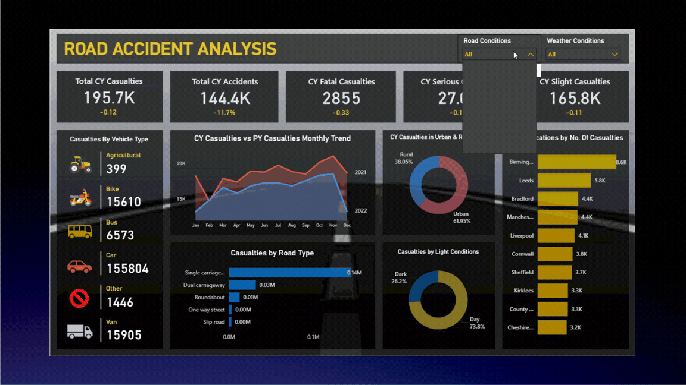
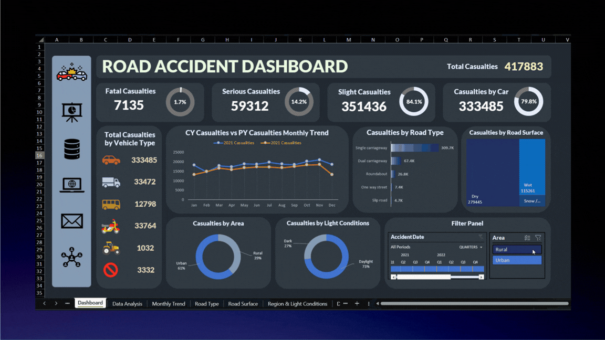

# 🚦 Road Accident Data Analysis Project

This project analyzes **307,973 UK road accident records (2021–2022)** to uncover patterns in casualties, road types, weather, vehicles, locations, and time factors.

The objective is to convert raw accident data into **actionable insights for traffic authorities and road safety organizations** using SQL, Excel, Power BI, and Tableau.

---

## 📂 Dataset Overview

- **Source:** Kaggle – UK Road Accident Dataset
- **Records Analyzed:** 307,973
- **Years:** 2021 & 2022
- **Region:** United Kingdom
- **Validation:** Excel pivots, SQL queries, Power BI, Tableau dashboards

---

## 👥 Stakeholders

Ministry of Transport • Traffic Police • Road Departments • Urban Traffic Agencies • Emergency Services • Road Safety Organizations

---

## 🛠️ Tools Used

SQL • Excel • Power BI • Tableau • GitHub

---

## 📊 Key Insights with Numbers

### 1️⃣ Casualty Severity Distribution

| Severity | Casualties | Percentage |
|----------|------------|------------|
| Slight   | 351,436    | 84% |
| Serious  | 59,312     | 14% |
| Fatal    | 7,135      | 2% |

**Insight:** Accidents are primarily due to traffic discipline issues rather than high-speed crashes.

---

### 2️⃣ Monthly Trend — Peak in Oct & Nov

| Month | 2021 | 2022 |
|------|------|------|
| October | 20,109 | 18,287 |
| November | 20,975 | 18,439 |
| December | 18,576 | 13,200 |

**Insight:** Seasonal festive travel leads to predictable spikes.

---

### 3️⃣ Vehicle Type Contribution

| Vehicle Type | Casualties |
|--------------|------------|
| Cars | 33,485 |
| Vans | 33,472 |
| Bikes | 33,764 |
| Bus | 12,798 |
| Agricultural | 102 |

**Insight:** Private vehicle users contribute most to accidents.

---

### 4️⃣ Road Type Risk

| Road Type | Casualties |
|-----------|------------|
| Single Carriageway | 309,700+ |
| Dual Carriageway | 67,400+ |
| Roundabout | 26,800+ |
| One Way Street | 7,400+ |
| Slip Road | 4,700+ |

**Insight:** Single carriageways are a major infrastructure risk.

---

### 5️⃣ Road Surface Condition

| Surface | Casualties |
|---------|------------|
| Dry | 279,445 |
| Wet | 115,261 |
| Snow/Ice | 22,781 |

**Insight:** Dry roads lead to more accidents due to driver overconfidence.

---

### 6️⃣ Weather Condition Impact

| Weather | Casualties |
|---------|------------|
| Fine | 158,000+ |
| Rain | 26,300 |
| Snow/Fog | 13,200 |

**Insight:** Good weather contributes more to accidents than bad weather.

---

### 7️⃣ Urban vs Rural

| Area | Casualties |
|------|------------|
| Urban | 255,864 |
| Rural | 162,019 |

**Insight:** Congestion is a bigger risk factor than speed.

---

### 8️⃣ Day vs Night

| Light Condition | Casualties |
|-----------------|------------|
| Daylight | 304,963 |
| Dark | 112,920 |

**Insight:** Traffic volume is a bigger factor than visibility.

---

### 9️⃣ Location Hotspots

| City | Casualties |
|------|------------|
| Birmingham | 8,611 |
| Leeds | 5,821 |
| Manchester | 4,366 |

**Insight:** These cities require permanent monitoring.

---

## 📸 Dashboard Previews (GIF)

> These dashboards were created based on different client tool requirements using the same validated dataset.

### 🔹 Power BI

### 🔹 Excel

### 🔹 Tableau

---

## 🗂️ Repository Structure

- [Dashboard_Gifs](Dashboard_Gifs/) → GIF previews of dashboards  
- [Data](Data/) → Raw & cleaned datasets used for analysis  
- [Documentations](Documentations/) → Insight report explaining business findings  
- [Excel_Dashboard](Excel_Dashboard/) → Excel dashboard file  
- [POWER_BI](POWER_BI/) → Power BI dashboard (.pbix)  
- [TABLEAU](TABLEAU/) → Tableau dashboard workbook  
- [SQL](SQL/) → SQL queries used for data validation  
- [README.md](README.md) → Project documentation

---

## ✅ SQL Validation

All dashboard KPIs, charts, and insights were validated using SQL queries on the raw dataset before building the dashboards.

Validation includes:

- Casualty severity distribution
- Monthly trend comparison (2021 vs 2022)
- Vehicle type contribution
- Road type risk analysis
- Road surface & weather condition impact
- Urban vs Rural distribution
- Day vs Night analysis
- Top 10 accident hotspot locations

📁 View SQL queries here:  
👉 [SQL Folder](SQL/)  
📄 Direct file: [sql_validation_queries.sql](SQL/sql_validation_queries.sql)

---

## 🏁 Final Conclusion

From **307,973 UK road accident records**, it is clear that accidents are mainly driven by:

- Driver overconfidence in comfortable road and weather conditions
- Urban congestion and junction density
- Poor single carriageway road design
- Traffic discipline issues rather than high-speed crashes

This project converts raw accident data into **clear, data-backed guidance** for traffic authorities and road safety organizations to take focused actions instead of generic awareness programs.

---

## 👤 Author

**Ahad Ansari**  
NIT Bhopal  
Aspiring Data Analyst | Business Analytics | Data Science

